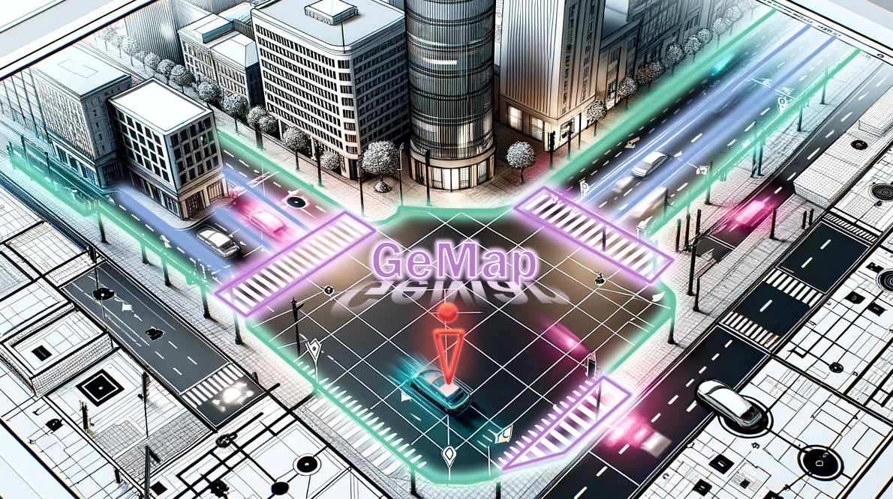
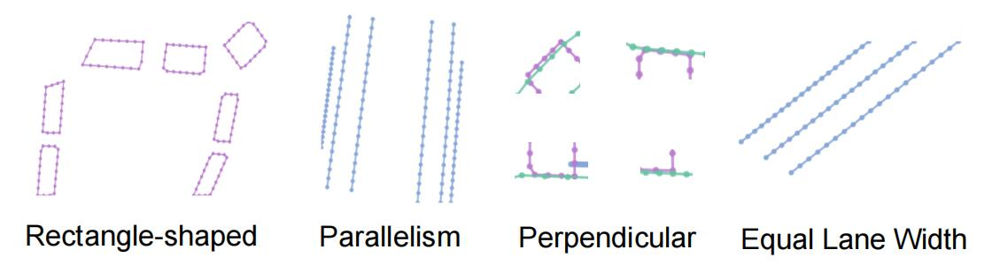

<div align='center'>
</img>
</div>

<div align="center">
<h3>[ECCV'24] Online Vectorized HD Map Construction Using Geometry </h3>

[Zhixin Zhang](https://github.com/cnzzx)<sup>1</sup>, [Yiyuan Zhang](https://invictus717.github.io/)<sup>2</sup>, [Xiaohan Ding](https://dingxiaohan.xyz/)<sup>3</sup>, [Fusheng Jin](https://cs.bit.edu.cn/szdw/jsml/fjs/jfs/index.htm)<sup>1\*</sup>, [Xiangyu Yue](http://xyue.io/)<sup>2</sup>
 
<sup>1</sup>Beijing Institute of Technology, &nbsp;
<sup>2</sup>CUHK, &nbsp;
<sup>3</sup>Tencent AI Lab

[Website](https://invictus717.github.io/GeMap/) | [arXiv](https://arxiv.org/abs/2312.03341) | [YouTube](https://www.youtube.com/watch?v=dU4XN4GQ1y4) | [Bilibili](https://www.bilibili.com/video/BV1qN4y1e7hL/?vd_source=96a766e4a548cf05b04bf247d9824a01) | [Zhihu](https://zhuanlan.zhihu.com/p/671139382)

</div>

<div align='center'>
</img>
</div>

## News
We're working on more powerful and efficient models, please stay tuned.

- **(2024/7/2)** GeMap is accepted by ECCV 2024 and we release a new GeMap model with **76.0 mAP**.
- **(2023/12/7)** We released the first version of GeMap (with pre-trained checkpoints and evaluation).
- **(2023/12/7)** GeMap is released on [arXiv](xxx).

## Motivation

- Recent efforts have built strong baselines for online vectorized HD map construction task, however, shapes and relations of instances in urban road systems are still under-explored, such as parallelism, perpendicular, or rectangle-shape. 

<div align='center'>
</img>
</div>

- As the ego vehicle moves, the shape of a specific instance or the relations between two instances will remain unchanged. To accurately represent such geometric features, invariance to rigid transformation is a fundamental property.

<div align='center'>
</img>
</div>

## Highlights
This work contributes from two perspectives:
- GeMap achieves new state-of-the-art performance on the NuScenes and Argoverse 2 datasets. Remarkably, it reaches a 71.8% mAP on the large-scale Argoverse 2 dataset, outperforming MapTR V2 by +4.4% and surpassing the 70% mAP threshold for the first time.
- GeMap end-to-end learns Euclidean shapes and relations of map instances beyond basic perception. Specifically, we design a geometric loss based on angle and distance clues, which is robust to rigid transformations. We also decouple self-attention to independently handle Euclidean shapes and relations. 

## Quantitative Results

### NuScenes

|   Model   | Objective | Backbone | Epoch | mAP  | FPS  | Config / Log | Checkpoint |
| :-------: | :------: | :--: | :--: | :--: | :--: | :--: | :--: |
| GeMap | simple | R50 | 110 | 62.7 | 15.6 | [config](projects/configs/gemap/gemap_simple_r50_110ep.py)/[log](https://drive.google.com/file/d/1OYP1vGdI4H3hdqGAIkmoCnXHiGX-U0sr/view?usp=drive_link) | [model](https://drive.google.com/file/d/1QNmluapTm_hH-ofMi_QsKXLG2bp38wEW/view?usp=drive_link) |
| GeMap | simple | Camera(R50) & LiDAR(SEC) | 110 | 66.5 | 6.8 | [config](projects/configs/gemap/gemap_simple_r50_sec_110ep.py)/[log](https://drive.google.com/file/d/1aMDhYwHzLT5rINZFgc8R32xIJQdZP4og/view?usp=drive_link) | [model](https://drive.google.com/file/d/1fgHcEcCC2EmUOl8wzqY1Y8lBvG6abXID/view?usp=drive_link) |
| GeMap | full | R50 | 110 | 69.4 | 13.3 | [config](projects/configs/gemap/gemap_full_r50_110ep.py)/[log](https://drive.google.com/file/d/1zAs7VXFX4C9K8oFeYkw7CLW1wl6Y-CWw/view?usp=drive_link) | [model](https://drive.google.com/file/d/1-tSNztiVRXXlofiVStj3KzLTG1sbtKtF/view?usp=drive_link) |
| GeMap | full | Swin-T | 110 | 72.0 | 10.0 | [config](projects/configs/gemap/gemap_full_swint_110ep.py)/[log](https://drive.google.com/file/d/1jeTvf1-tFh9l2mz16xy0dMNfG5q9WiJ1/view?usp=drive_link) | [model](https://drive.google.com/file/d/1f4vEaC1d73MLGzl_5wfX5QX3fgPsGkYC/view?usp=drive_link) |
| GeMap | full | V2-99 | 110 | 72.2 | 9.5 | [config](projects/configs/gemap/gemap_full_vov99_110ep.py)/[log](https://drive.google.com/file/d/11UpYspRr-6naYAIWoxnBPVCjyOxCIon3/view?usp=drive_link) | [model](https://drive.google.com/file/d/1_KZAqMgg87R8k_ufpJC38O1CtjFcsURL/view?usp=drive_link) |
| GeMap | full | V2-99(DD3D) | 110 | 76.0 | 9.5 | [config](projects/configs/gemap/gemap_full_vov99_dd3d_110ep.py)/[log](https://drive.google.com/file/d/1-GTM3rZ7V7TRkQzC6BDnG1lLsbjslzMU/view?usp=drive_link) | [model](https://drive.google.com/file/d/17VlL5fqFHu5WmqIKeUoWEmbzWF5UmbyX/view?usp=drive_link) |


### Argoverse 2

|   Model   | Objective | Backbone | Epoch | mAP  | FPS  | Config / Log | Checkpoint |
| :-------: | :------: | :--: | :--: | :--: | :--: | :--: | :--: |
| GeMap | simple | R50 | 6 | 63.9 | 13.5 | [config](projects/configs/gemap/gemap_av2_simple_r50_6ep.py)/[log](https://drive.google.com/file/d/1zrd5uX7XDRyHh8JEIvge053QF-NAYlJQ/view?usp=drive_link) | [model](https://drive.google.com/file/d/1H5qIxz5ED6Dnlo9xaOqntTocVQDuPbrZ/view?usp=drive_link) |
| GeMap | simple | R50 | 24 | 68.2 | 13.5 | [config](projects/configs/gemap/gemap_av2_simple_r50_24ep.py)/[log](https://drive.google.com/file/d/1sWtTvSSTdnLjVpJJev6YRy3mU6cWeW4W/view?usp=drive_link) | [model](https://drive.google.com/file/d/1I9bs7t2AfuNICjqy_Tfpce673tAyrlOB/view?usp=drive_link)
| GeMap | full | R50 | 24 | 71.8 | 12.1 | [config](projects/configs/gemap/gemap_av2_full_r50_24ep.py)/[log](https://drive.google.com/file/d/1YCyEBTmW7npMdQu9fyCXOSXKedYlQOWW/view?usp=drive_link) | [model](https://drive.google.com/file/d/1go2xMgjIdLMrKg9mwkaHvvcVVSxlVdFD/view?usp=drive_link) |

\* All models are trained on 8 NVIDIA RTX3090 GPUs. The speed (Frames Per Second, FPS) is evaluated on a single 3090 GPU.

## Visualization Results

### Comparison Video

GeMap exhibits more robust predictions in occluded and rotated scenarios, especially under rainy weather conditions.

<div align='center'>
<video src='https://github.com/cnzzx/GeMap-dev/assets/71703448/f5213adb-15a3-49a4-94c1-f4fe8e43babd.mp4' width='88%' height='auto'></video>
</div>

### More Cases of GeMap

<div align='center'>
</img>
</div>

## Getting Started
- [Installation](./docs/install.md)
- [Prepare Dataset](./docs/prepare_dataset.md)
- [Train and Eval](./docs/train_eval.md)
- [Visualization](./docs/visualization.md)

## TODO
- [ ] Faster implementation for inference of GeMap.
- [ ] More powerful LiDAR and Camera + LiDAR models.
- [ ] Lighter and faster models with 30+ FPS.

## Acknowledgements

GeMap is based on [mmdetection3d](https://github.com/open-mmlab/mmdetection3d). It is also greatly inspired by the following outstanding contributions to the open-source community: [LSS](https://github.com/nv-tlabs/lift-splat-shoot), [GKT](https://github.com/hustvl/GKT), [Swin-Transformer](https://github.com/microsoft/Swin-Transformer), [VoVNet](https://github.com/youngwanLEE/vovnet-detectron2), [BEVFormer](https://github.com/fundamentalvision/BEVFormer), [MapTR](https://github.com/hustvl/MapTR), [BeMapNet](https://github.com/er-muyue/BeMapNet), [HDMapNet](https://github.com/Tsinghua-MARS-Lab/HDMapNet).


## Citation

If the paper and code help your research, please kindly cite:

```bibtex
@article{zhang2023online,
  title={Online Vectorized HD Map Construction using Geometry},
  author={Zhang, Zhixin and Zhang, Yiyuan and Ding, Xiaohan and Jin, Fusheng and Yue, Xiangyu},
  journal={arXiv preprint arXiv:2312.03341},
  year={2023}
}
```


